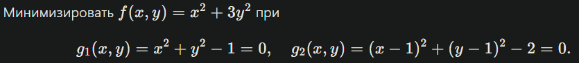
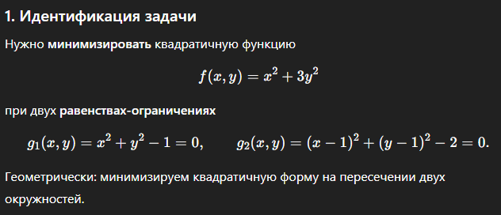
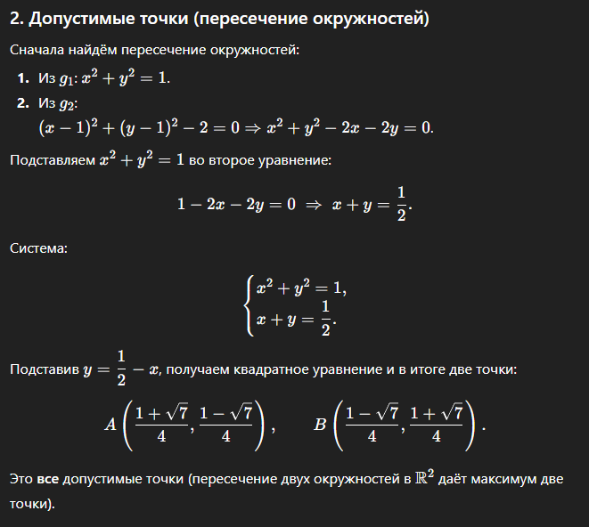
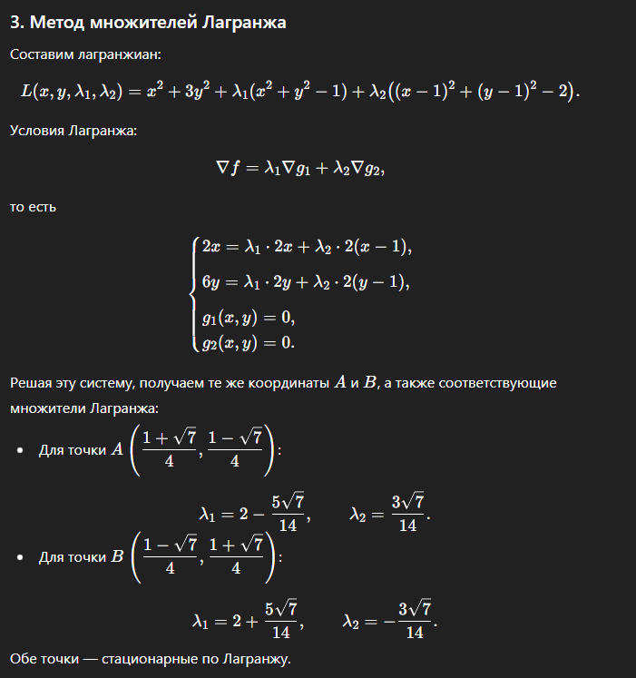
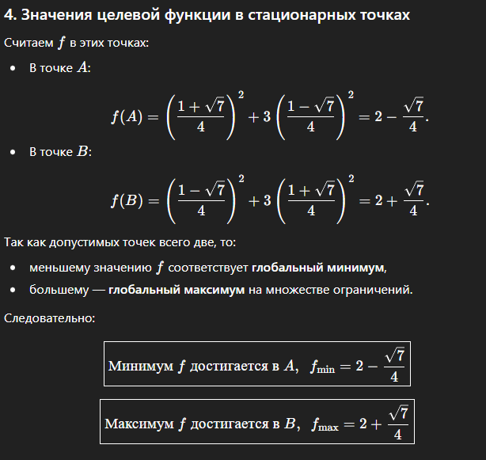
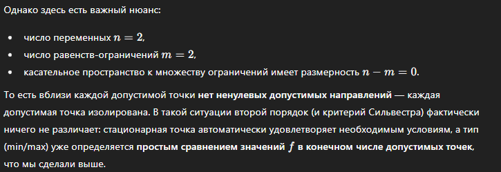
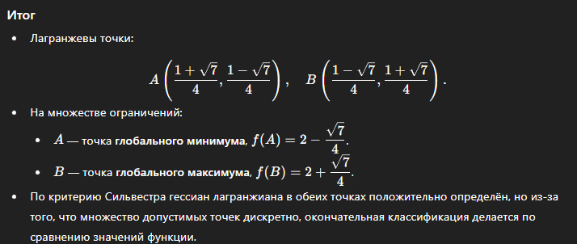
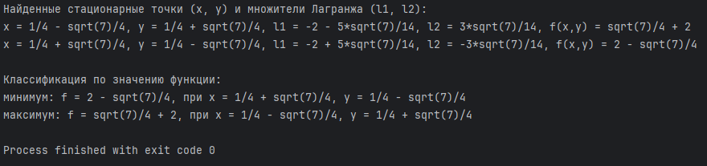

# Решение задачи условной выпуклой оптимизации с помощью метода множителей Лагранжа

Выполнила:

- **Гайдук Алина Сергеевна**
- Поток: **Мет Опт 1.1**
- Вариант задания: **6**

---
[ССЫЛКА НА РЕВЬЮ](https://drive.google.com/drive/folders/1m7hUv7nkykJPbkaMHuLYUP9LNUEj4LlQ)
---

## Условие задачи (вариант)

Ниже приведена задача условной оптимизации, которую требуется решить с помощью метода множителей Лагранжа:



Задачу необходимо решить с помощью большой языковой модели (далее БЯМ).

## Промпт для БЯМ

*Ниже приведена задача условной оптимизации, которую требуется решить с помощью метода множителей Лагранжа. Она записана в Markdown формате. Пожалуйста идентифицируй задачу и реши ее с помощью метода множителей Лагранжа. Проверь характер найденных точек с помощью критерия Сильвестра.*

К промпту был предоставлен вариант задачи, представленной на скрине выше, но в формате MarkDown.

## Решение БЯМ

Первым шагом была идентификация задачи:



Идентификация корректна: это задача минимизации квадратичной формы при двух равенствах-ограничениях, каждое из которых задаёт окружность.

Далее БЯМ ищет допустимые точки:



Используя уравнение окружности для ограничений, БЯМ корректно нашла их пересечение. Получилось две точки, которые удовлетворяют обоим ограничениям.

После этого БЯМ составляет лагранжиан и ищет множители Лагранжа:



Модель записала лагранжиан в стандартном виде: целевая функция плюс множители Лагранжа, умноженные на ограничения. 

Далее она выписала условие стационарности в градиентной форме: градиент целевой функции выражается через комбинацию градиентов ограничений.

Затем модель заявляет конкретные значения множителей Лагранжа в каждой из найденных точек. 

Модель перешла к вычислению значенйи функции в найденных точках: 



Значения функции в допустимых точках посчитаны верно.

Верно сделан вывод: одна точка даёт меньшее значение (условный минимум), другая - большее (условный максимум) на множестве из двух точек.

Далее модель проводит проверку по критерию Сильвестра:


Матрица вторых производных Лагранжиана по x,y вычислена правильно.

Главные миноры для обеих точек действительно положительны, то есть сама матрица положительно определена.

Однако есть методологический нюанс:



В данной задаче число ограничений равно числу переменных, поэтому характер экстремума окончательно устанавливается сравнением значений функции в найденных точках;
проверка критерия Сильвестра в данном случае носит скорее иллюстративный характер.

Результат, к которому пришла БЯМ:



Все шаги (решение системы ограничений, метод Лагранжа, значения функции) выполнены правильно, выводы о точке минимума и максимума так же корректны.

## Решение с помощью программы на Python

Ниже представлен код, написанный для решения данной задачи:

```
import sympy as sp

# Переменные и множители Лагранжа
x, y, l1, l2 = sp.symbols('x y l1 l2', real=True)

# Целевая функция
f = x**2 + 3*y**2

# Ограничения
g1 = x**2 + y**2 - 1
g2 = (x - 1)**2 + (y - 1)**2 - 2

# Уравнения стационарности (градиент Лагранжиана = 0)
# L = f + l1*g1 + l2*g2
eq1 = sp.diff(f, x) + l1 * sp.diff(g1, x) + l2 * sp.diff(g2, x)  # dL/dx = 0
eq2 = sp.diff(f, y) + l1 * sp.diff(g1, y) + l2 * sp.diff(g2, y)  # dL/dy = 0

# Ограничения (g1 = 0, g2 = 0)
eq3 = g1
eq4 = g2

# Решаем систему уравнений
solutions = sp.solve((eq1, eq2, eq3, eq4), (x, y, l1, l2), dict=True)

print("Найденные стационарные точки (x, y) и множители Лагранжа (l1, l2):")
for sol in solutions:
    x_val = sp.simplify(sol[x])
    y_val = sp.simplify(sol[y])
    l1_val = sp.simplify(sol[l1])
    l2_val = sp.simplify(sol[l2])
    f_val = sp.simplify(f.subs({x: x_val, y: y_val}))
    print(f"x = {x_val}, y = {y_val}, l1 = {l1_val}, l2 = {l2_val}, f(x,y) = {f_val}")

# Определим минимум/максимум по значению f
print("\nКлассификация по значению функции:")
values = []
for sol in solutions:
    x_val = sp.simplify(sol[x])
    y_val = sp.simplify(sol[y])
    f_exact = sp.simplify(f.subs({x: x_val, y: y_val}))  # точное выражение
    f_num = sp.N(f_exact)  # численное значение только для сортировки
    values.append((f_num, f_exact, x_val, y_val))

# Сортировка по численному значению f
values_sorted = sorted(values, key=lambda t: t[0])

for i, (f_num, f_exact, x_val, y_val) in enumerate(values_sorted):
    kind = "минимум" if i == 0 else "максимум"
    print(f"{kind}: f = {f_exact}, при x = {x_val}, y = {y_val}")
```

Отображаемый вывод:



Результат, полученный с помощью БЯМ и с помощью программы на Python совпал.

## Вывод

Вот вариант короткого вывода с упоминанием БЯМ:

В этой лабораторной работе я решила задачу условной оптимизации методом множителей Лагранжа с помощью БЯМ,
а затем написала решение на Python с использованием библиотеки SymPy.
Я сравнила решение, полученное с помощью БЯМ, с результатами программы на Python: координаты точек и значения функции совпали.
Это подтверждает корректность как моего решения, так и сгенерированного БЯМ варианта.
